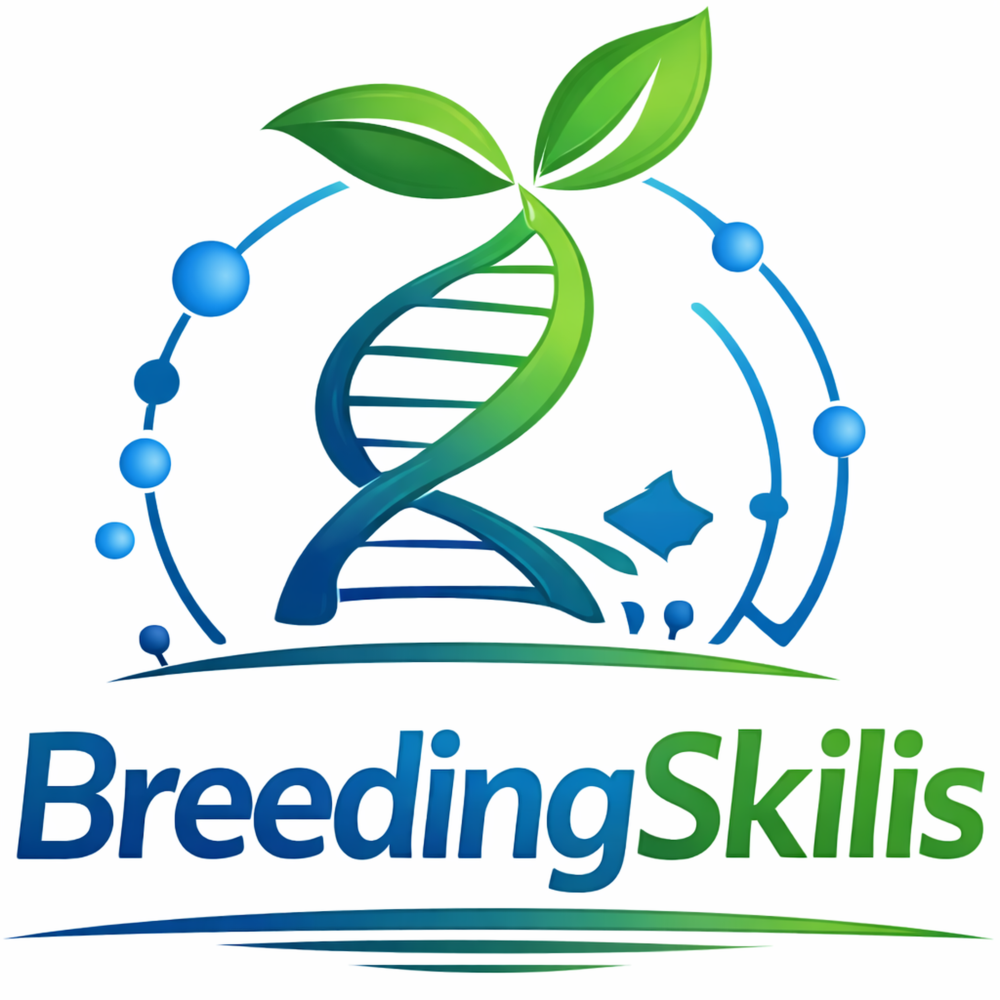
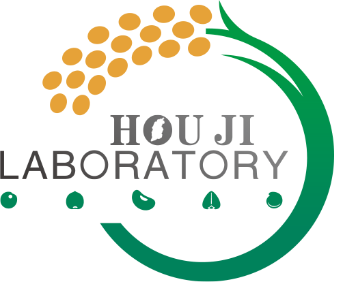

  <p align="center">
    
  </p>

  <p align="center">
    
    &emsp;&emsp;&emsp;
    
  </p>

  # BreedingSkills

# BreedingSkills

[English](README.md) | [简体中文](README.zh-CN.md)

BreedingSkills is a skill repository for breeding-oriented resequencing, GWAS, and QTL interpretation workflows.

The current version provides five core skills, and each skill follows the same layout:

- `SKILL.md`: required core instructions
- `scripts/`: optional example scripts
- `references/`: optional reference material
- `assets/`: optional templates

## Skills

- `skills/resequencing-skill`: raw FASTQ quality control, trimming, and read alignment
- `skills/variant-calling-skill`: variant calling, normalization, and filtering
- `skills/emmax-prep-skill`: EMMAX input preparation, covariates, and kinship
- `skills/gwas-skill`: EMMAX GWAS execution and result organization
- `skills/qtl-skill`: QTL interpretation and candidate gene collection

## Entry Points

- Skill index: `skills/INDEX.md`
- Per-skill instructions: each skill folder contains its own `SKILL.md`

## Agent Installation

BreedingSkills is a local skill repository, not a web service. To make an agent use these skills, install them into the agent's local skills directory.

### Codex CLI

```bash
git clone https://github.com/YYsama11/BreedingSkills.git
cd BreedingSkills
bash install-codex.sh
```

### Claude Code

```bash
bash install-claude.sh
```

### Gemini CLI

```bash
bash install-gemini.sh
```

### OpenClaw

```bash
bash install-openclaw.sh
```

## Installer Features

- `--list`: list all installable skills
- `--validate`: validate skill structure before installation
- `--skills resequencing-skill,gwas-skill`: install only selected skills
- `--project`: install into the current project workspace instead of the global directory
- `--update`: refresh only skills whose source changed
- `--uninstall`: remove previously installed BreedingSkills
- `--dry-run`: preview what would be installed

Example:

```bash
bash install-codex.sh --skills gwas-skill,qtl-skill --project
```
